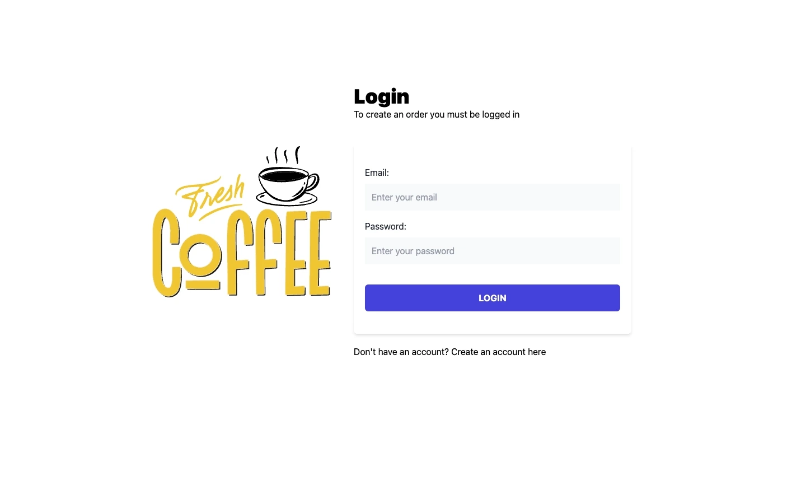
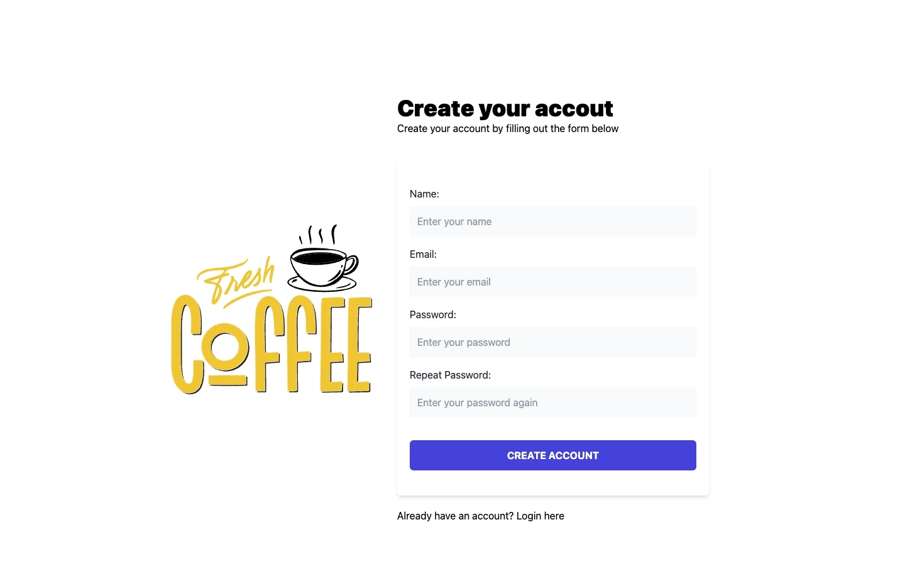
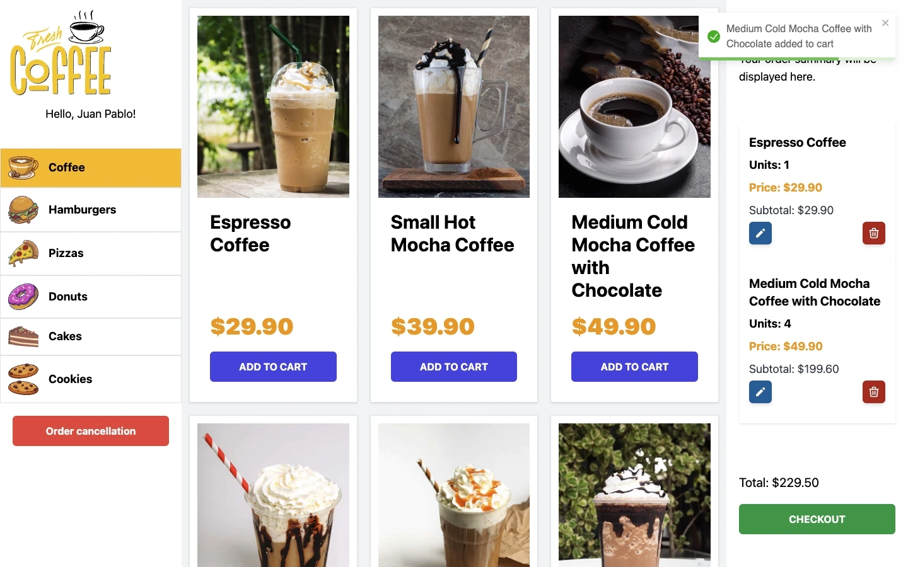
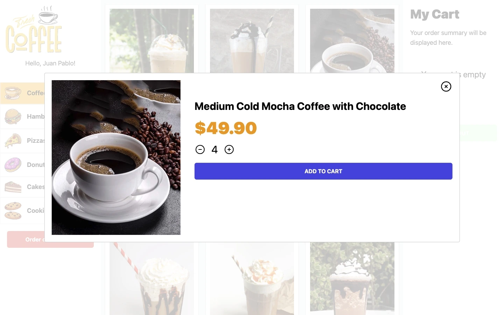
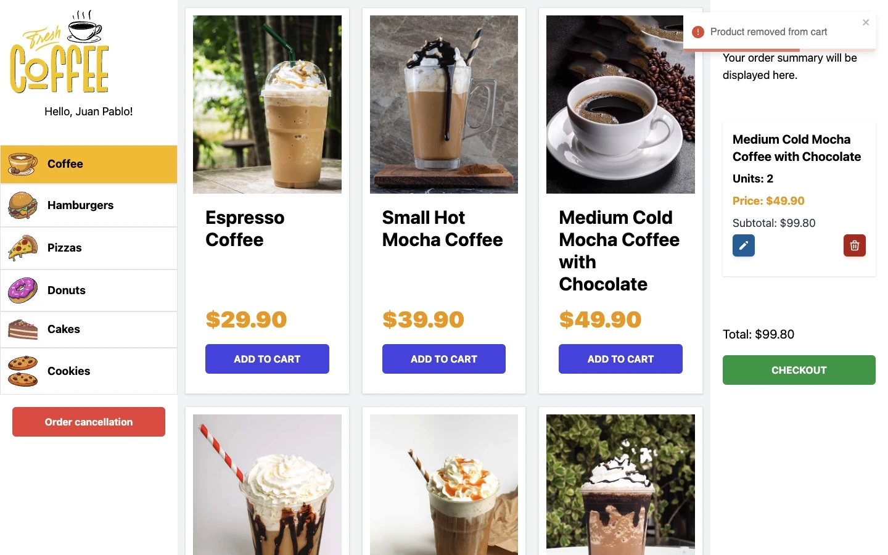
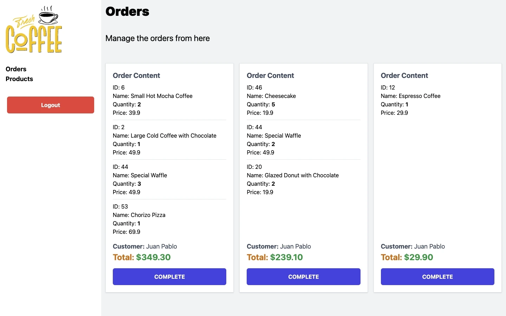

# FreshCoffee

FreshCoffee is a Full Stack e-commerce platform tailored for food kiosks or small dining businesses that want to offer a smooth and efficient online ordering experience.
Designed with [Laravel](https://laravel.com) on the backend and [React + Vite](https://vite.dev/guide/) on the frontend, FreshCoffee provides a complete solution for customers to browse, order, and enjoy various small dishes in just a few clicks.
This project showcases a practical approach to building an intuitive, responsive, and user-friendly web application where users can:

- **Visually explore the menu** with high-quality images, designed to offer a seamless experience on touchscreens in food kiosk settings.
- **Easily place orders** by quickly selecting products, choosing quantities, and adding them to the cart in a few simple steps.
- **Review and manage their orders in real time**, with options to adjust quantities, remove items, and see an updated order total instantly.
- **Complete purchases quickly and efficiently**, allowing customers to submit their order in just a few taps, so the food kiosk staff can process and prepare it promptly.

## Preview

Here are some screenshots of the FreshCoffee interface:

- **Login Screen | Create Account**
    

        
        
    

    *User-friendly login screen allowing users to securely access their accounts. Simple and streamlined account creation process for new users.*

- **Home Screen for Customers**
    
    *The menu screen with high-quality images for an engaging touchscreen experience.*
    *Intuitive product filtering and categorization to help users easily navigate and find desired items.*

- Quantity Selection
    
    *Flexible quantity selection, allowing customers to adjust the number of items they wish to purchase.*

- **Real-time Notifications**
    
    *Instant notifications that inform users of actions taken, such as item selection, updates, or removal from the cart.*

- **Active Orders Dashboard (Admin)**
    
    *Admin dashboard displaying all active orders in real-time for efficient management and fulfillment.*

- **Product Availability Management (Admin)**
    
    *Admin feature for managing product availability, allowing items to be temporarily disabled.*

## Features
- Login / Sign Up: Users can register and log in to manage their purchases.
- Product View by Categories: Products are organized by categories for easy navigation and search.
- Edit Product Quantities: Users can adjust product quantities before adding them to the cart.
- React Notifications: Actions such as adding, editing, or removing items from the cart generate real-time notifications.
- Order Management: Administrators can manage purchase orders made by users.
- Product Management: Administrators have the ability to manage the available products in the store.
- Responsive Design: The site is adapted for viewing on different devices, with a primary focus on horizontal PC screens.
