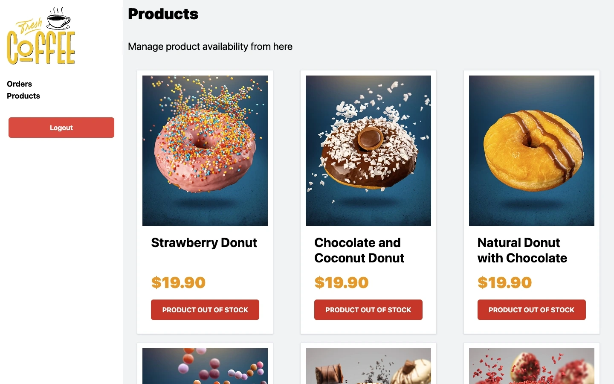

# FreshCoffee | Snack-Attack-Kiosk

FreshCoffee is a Full Stack e-commerce platform tailored for food kiosks or small dining businesses that want to offer a smooth and efficient online ordering experience.
Designed with [Laravel](https://laravel.com) on the backend and [React + Vite](https://vite.dev/guide/) on the frontend, FreshCoffee provides a complete solution for customers to browse, order, and enjoy various small dishes in just a few clicks.
This project showcases a practical approach to building an intuitive, responsive, and user-friendly web application where users can:

- **Visually explore the menu** with high-quality images, designed to offer a seamless experience on touchscreens in food kiosk settings.
- **Easily place orders** by quickly selecting products, choosing quantities, and adding them to the cart in a few simple steps.
- **Review and manage their orders in real time**, with options to adjust quantities, remove items, and see an updated order total instantly.
- **Complete purchases quickly and efficiently**, allowing customers to submit their order in just a few taps, so the food kiosk staff can process and prepare it promptly.

## Preview

Here are some screenshots showcasing the key features of FreshCoffee:

- **Login Screen | Create Account**
    

        
        
    

    *User-friendly login screen allowing users to securely access their accounts.*
    *Simple and streamlined account creation process for new users.*

- **Home Screen for Customers**
    

    *The menu screen with high-quality images for an engaging touchscreen experience.*
    *Intuitive product filtering and categorization to help users easily navigate and find desired items.*

- **Quantity Selection**
    

    *Flexible quantity selection, allowing customers to adjust the number of items they wish to purchase.*

- **Real-time Notifications**
    

    *Instant notifications that inform users of actions taken, such as item selection, updates, or removal from the cart.*

- **Active Orders Dashboard (Admin)**
    

    *Admin dashboard displaying all active orders in real-time for efficient management and fulfillment.*

- **Product Availability Management (Admin)**
    

    *Admin feature for managing product availability, allowing items to be temporarily disabled.*

## Key Technical Features

- **Full Stack Project:** Built with Laravel on the backend and React with Vite on the frontend, providing a complete solution for fast-food kiosks.
- **Responsive Design:** Optimized primarily for large screens, ideal for kiosk displays in fast-food establishments.
- **Real-Time Notifications:** React-Toastify enables real-time notifications, allowing users to see updates immediately when items are added, modified, or removed from the cart.
- **SQL Database:** Uses SQL for reliable and efficient data storage of orders, products, and user information.
- **Admin Panel:** Provides an order management panel, allowing administrators to track active orders and control product availability.

This setup offers a smooth and efficient online ordering experience tailored for food kiosks, making it easy for users to browse, order, and manage their purchases.
